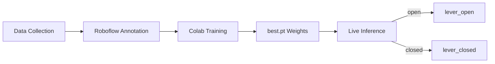

# DesktopQualityInspector

[](https://www.python.org/)
[](https://github.com/ultralytics/ultralytics)
[](https://opencv.org/)
[]()
[](LICENSE)

Real-time visual state detection for mechanical components: a custom-trained YOLO model watches a live camera feed and classifies whether the inspected part is in one state or another — e.g. open or closed — drawing a color-coded bounding box on screen the instant it changes.

Many quality checks come down to a single yes/no question that's normally answered by eye or with a dedicated sensor wired into a control system. DesktopQualityInspector answers it with a camera instead, building the entire pipeline — data collection, annotation, training, and inference — on consumer hardware and free-tier cloud services: a phone doubles as the camera via [DroidCam](https://dev47apps.com/), [Roboflow](https://roboflow.com) handles annotation and dataset versioning, [Google Colab](https://colab.research.google.com) provides free GPU training, and inference runs locally through [Ultralytics YOLO](https://github.com/ultralytics/ultralytics) and OpenCV. The bundled example uses a simple two-state mechanical lever, but the pipeline is class-agnostic: relabel any two states you can photograph, retrain, and `config.py` / `live_inference.py` work unchanged.

## Table of Contents

- [Preview](#preview)
- [Features](#features)
- [Limitations](#limitations)
- [How It Works](#how-it-works)
- [Tech Stack](#tech-stack)
- [Design Decisions](#design-decisions)
- [Project Structure](#project-structure)
- [Getting Started](#getting-started)
- [Usage](#usage)
- [Building Your Own Dataset](#building-your-own-dataset)
- [Training the Model](#training-the-model)
- [Configuration](#configuration)
- [Testing](#testing)
- [Roadmap](#roadmap)
- [Contributing](#contributing)
- [License](#license)

## Preview

> ?? Demo GIF coming soon — model training in progress.

*Green box for `lever_open`, red for `lever_closed`, updated live frame by frame — see [Usage](#usage).*

## Features

- **Real-time state detection** — bounding boxes and class labels overlaid on a live webcam feed, updated every frame
- **Color-coded results** — each class renders in its own color, configurable in one place ([`src/config.py`](src/config.py))
- **Wireless webcam support** — use an Android phone as the camera via DroidCam; no capture card or USB webcam required
- **Camera index scanner** ([`scripts/list_cameras.py`](scripts/list_cameras.py)) — previews every available camera index so you're never guessing which one is the right one
- **Fully configurable at runtime** — model path, camera source, confidence threshold, and inference resolution are all CLI flags
- **Live FPS overlay** — see actual inference throughput on screen while testing
- **Clean shutdown** — the camera is released and windows closed correctly on exit, even if the script errors mid-loop
- **Reproducible training recipe** — a documented, free, GPU-backed Colab notebook turns any annotated dataset into a new `best.pt` in a few steps
- **No committed binaries** — dataset images and trained weights are deliberately kept out of git (see [Design Decisions](#design-decisions)), so the repository stays small and fast to clone
- **Smoke-tested** — a small `pytest` suite validates configuration wiring without needing a camera, model, or GPU

## Limitations

The following are open, known characteristics of the current pipeline rather than bugs to be silently discovered:

- Detection quality depends far more on training-data diversity (lighting, angle, background) than on raw photo count — a small but varied dataset consistently outperforms a large but repetitive one
- `cv2.CAP_DSHOW` is used explicitly to avoid a black-screen issue with virtual webcams on Windows (see [Design Decisions](#design-decisions)) — running on Linux or macOS requires adjusting the backend in `open_camera()`
- Inference runs on CPU by default; 10–15 FPS is adequate for a live desk-level demo but not for high-speed production-line throughput without a dedicated inference GPU or edge accelerator
- The bundled example is a single binary state pair (`lever_open` / `lever_closed`); multiple simultaneous objects or more than two classes per frame are supported by the underlying model but untested against this project's dataset
- Streaming over Wi-Fi (DroidCam) introduces latency and is more sensitive to network quality than a wired USB camera

## How It Works



1. **Data Collection** — photos of the component in each state, captured from a webcam or a phone repurposed as one via DroidCam.
2. **Roboflow Annotation** — one bounding box per photo, labeled with the target class; Roboflow versions the dataset and can apply light augmentation (rotation, brightness, blur) to multiply it for free.
3. **Colab Training** — a YOLO11n / YOLO26n checkpoint is fine-tuned on the annotated dataset using a free T4 GPU, producing `best.pt`.
4. **Live Inference** — [`src/live_inference.py`](src/live_inference.py) loads `best.pt` and runs it on every frame of a live camera feed, drawing a color-coded box and label for whichever state it detects.

## Tech Stack

| Dependency | Version | Notes |
|---|---|---|
| Python | 3.9+ | |
| ultralytics | >=8.4.0 | YOLO11 / YOLO26 model implementation — training (Colab) and inference (local) |
| opencv-python | >=4.10.0 | Video capture, frame rendering, bounding-box overlay |
| DroidCam | — | Turns an Android phone into a wireless webcam over Wi-Fi; used for data collection and live demos, not a Python dependency |
| Roboflow | — | Browser-based annotation, dataset versioning, augmentation, and YOLO-format export |
| Google Colab | — | Free T4 GPU for training; no local CUDA setup required |
| pytest | — | Smoke tests for configuration wiring — see [Testing](#testing) |

## Design Decisions

**Why DroidCam instead of a dedicated camera?** A phone turned into a wireless webcam over Wi-Fi removes any extra hardware purchase while exercising the exact same `cv2.VideoCapture` code path a USB or IP industrial camera would use — swapping in real hardware later is a `--source` value change, not a pipeline change.

**Why Roboflow instead of manual annotation?** Bounding-box labeling, dataset versioning, train/valid/test splitting, and augmentation are handled in one tool, with a one-click export directly into the format `ultralytics` expects — no custom conversion scripts to write or maintain.

**Why train on Google Colab instead of locally?** A free T4 GPU with zero local CUDA/driver setup, in a notebook anyone cloning the repository can re-run from scratch against their own dataset.

**Why a nano (`n`) model?** `live_inference.py` targets real-time inference on a normal CPU, not a dedicated inference GPU. A YOLO11n / YOLO26n checkpoint trades a small amount of accuracy for the speed a live demo needs, and is already more than sufficient for a simple binary-state detection task.

**Why keep the dataset and weights out of git?** Images and `.pt` weight files are large binary artifacts that bloat repository history and are trivially regenerable. The dataset is versioned on Roboflow and `best.pt` is one Colab run away — [`data/README.md`](data/README.md) and [`models/README.md`](models/README.md) document exactly how to reproduce both instead of committing them directly.

**Why `CAP_DSHOW` explicitly?** The default Windows video backend (MSMF) can show a black screen with virtual webcams like DroidCam; `cv2.CAP_DSHOW` avoids that failure mode reliably in both `open_camera()` and `scripts/list_cameras.py`.

## Project Structure

```
DesktopQualityInspector/
├── assets/                # Demo media referenced by this README (e.g. demo.gif)
│   └── README.md
├── data/                  # Dataset documentation — images are versioned on Roboflow, not in git
│   └── README.md
├── models/                # Trained weights — best.pt is gitignored, see models/README.md
│   └── README.md
├── notebooks/             # Step-by-step Google Colab training recipe
│   └── README.md
├── scripts/
│   └── list_cameras.py    # Utility to find the correct webcam / DroidCam index
├── src/
│   ├── config.py          # Model path, camera source, confidence threshold, class colors
│   └── live_inference.py  # Main entry point — real-time detection loop
├── tests/
│   └── test_smoke.py      # Configuration/dependency smoke tests
├── .gitignore
├── LICENSE
├── requirements.txt
└── README.md
```

## Getting Started

### Prerequisites

- Python 3.9 or later
- A webcam — either built-in/USB, or an Android phone with the [DroidCam](https://dev47apps.com/) app and its Windows client installed, connected to the same Wi-Fi network as the host machine
- A free [Roboflow](https://roboflow.com) account, if you plan to annotate your own dataset (see [Building Your Own Dataset](#building-your-own-dataset))
- A Google account, if you plan to train your own model on Colab's free GPU tier (see [Training the Model](#training-the-model))

### Installation

```bash
git clone https://github.com/mirconegri/DesktopQualityInspector.git
cd DesktopQualityInspector
python -m venv .venv
.venv\Scripts\activate      # Windows
source .venv/bin/activate   # macOS/Linux
pip install -r requirements.txt
```

Download a trained `best.pt` (see [Training the Model](#training-the-model)) and place it in `models/`.

## Usage

### 1. Find your camera index

```bash
python scripts/list_cameras.py
```

Scans camera indices, opens a preview window for each one that works, and overlays the index number so you can identify which one is DroidCam and which is a built-in camera. Press any key to move to the next index, `q` to stop scanning.

### 2. Run live inference

```bash
python src/live_inference.py
python src/live_inference.py --model models/best.pt --source 1 --conf 0.6 --imgsz 640
```

| Flag | Default | Description |
|---|---|---|
| `--model` | `models/best.pt` | Path to the trained YOLO weights |
| `--source` | `0` | Camera index, or a video file / stream URL |
| `--conf` | `0.5` | Minimum confidence to draw a detection |
| `--imgsz` | `640` | Inference resolution — lower is faster, less accurate |

A window opens with the live feed, a color-coded bounding box and confidence score for each detection, and a live FPS counter. Press `q` to quit — the camera is released cleanly every time, including on error.

## Building Your Own Dataset

The repository ships without a bundled dataset — bring your own photos of the states you want to classify.

1. **Capture photos** of the object in each state, varying angle, distance, lighting, and background between shots. Aim for a balanced set across at least 5–6 distinct angles and several lighting conditions — variety matters far more than raw volume.
2. **Annotate on [Roboflow](https://roboflow.com)** — create a free Object Detection project, upload your photos, and draw one bounding box per image, labeling each with a class name that matches [`src/config.py`](src/config.py)'s `CLASS_COLORS` keys **exactly**.
3. **Generate a dataset version**, optionally with light augmentation (rotation, brightness, blur) to multiply a small dataset for free, then export in **YOLO11** (or **YOLO26**) format and copy the generated download snippet for the training notebook.

Full details in [`data/README.md`](data/README.md).

## Training the Model

Training runs entirely on [Google Colab](https://colab.research.google.com)'s free T4 GPU tier — no local CUDA setup required. The complete notebook recipe lives in [`notebooks/README.md`](notebooks/README.md); in short:

```python
from ultralytics import YOLO

model = YOLO("yolo11n.pt")  # nano checkpoint, transfer learning
results = model.train(
    data=f"{dataset.location}/data.yaml",
    epochs=80,
    imgsz=640,
    batch=16,
    patience=15,
    name="lever-detector",
)
```

Validate with `model.val()` and check `metrics.box.map50` — for a simple binary-state task this should land above roughly 0.85–0.90; a lower score usually points to a dataset issue (class imbalance, ambiguous frames) rather than a model issue. Download the resulting `best.pt`, place it in `models/`, and record the achieved metrics in [`models/README.md`](models/README.md).

## Configuration

Runtime defaults live in [`src/config.py`](src/config.py) so they can be changed once instead of edited across scripts:

| Setting | Default | Description |
|---|---|---|
| `DEFAULT_MODEL_PATH` | `models/best.pt` | Path to the trained weights file |
| `DEFAULT_SOURCE` | `0` | Webcam index used when `--source` is not passed |
| `DEFAULT_CONFIDENCE` | `0.5` | Minimum confidence to display a detection |
| `CLASS_COLORS` | `lever_open` → green, `lever_closed` → red | BGR color per class — keys must match the class names used on Roboflow exactly |

No `.env` file or stored API keys are required to run inference locally. A Roboflow API key is only ever pasted transiently into the Colab training notebook and is never part of this repository.

## Testing

```bash
pip install pytest
pytest tests/
```

[`tests/test_smoke.py`](tests/test_smoke.py) checks that `config.py` exposes the settings `live_inference.py` depends on, that the confidence threshold and class colors are well-formed, and that `ultralytics` and `opencv-python` import correctly — all without needing a camera, a trained model, or a GPU.

## Roadmap

Natural next steps for extending this pipeline beyond a single binary state:

1. **Multi-state / multi-class support** — generalize beyond one open/closed pair to N configurable states
2. **Edge deployment** — export to ONNX or TensorRT to run on a Raspberry Pi or Jetson instead of a desktop CPU
3. **Detection logging** — timestamped records of every state change, for traceability over time
4. **Lightweight web dashboard** — remote monitoring of live detections over the network
5. **Docker image** — a fully reproducible, one-command setup

## Contributing

1. Fork the repository
2. Create a feature branch (`git checkout -b feature/your-feature`)
3. Commit your changes with a clear message
4. Open a Pull Request

For bugs or feature ideas, open an [Issue](https://github.com/mirconegri/DesktopQualityInspector/issues).

### Author

**Mirco Negri** — Computer Science @ UniTrento

[](https://mirconegri.github.io/Portfolio/)
[](https://github.com/mirconegri)
[](https://www.linkedin.com/in/mirco-negri-263810225)
[](mailto:mirconegri06@gmail.com)

## License

This project is licensed under the MIT License — see the [LICENSE](LICENSE) file for details.

